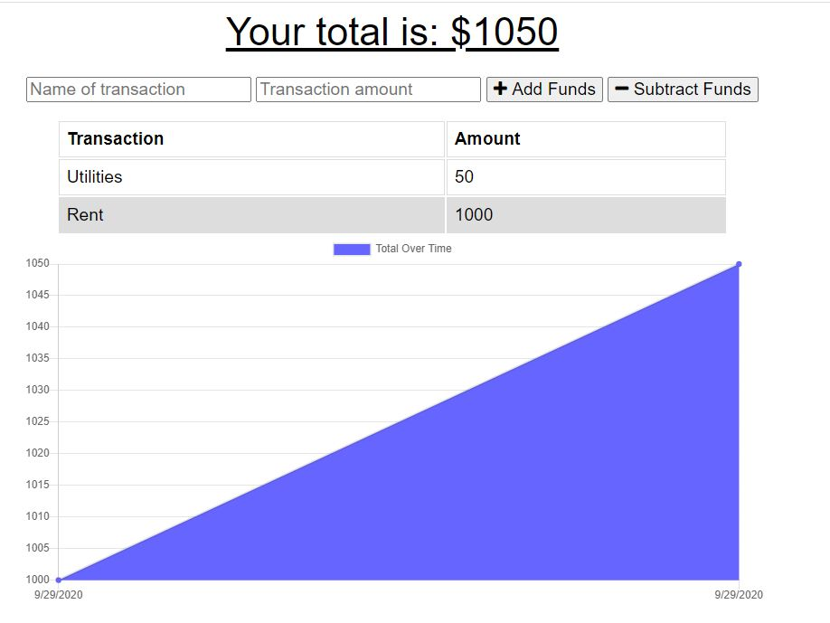

# social-interreactions

## Purpose
To create an application to track withdrawals and deposits with or without a data/internet connection to be used during travel.

## Features
When the user starts the server, they can view their current budget transactions. They can input an expense or a deposit when they are not connected to the internet, and will be notified of the completed trasaction update once connection is reestablished.

## Built With
* React JS
* JavaScript
* Node JS 
* NoSQL - MongoDB
* IndexedDB
* Express
* Mongoose

## Usage
To run program: node server

## Deployed Application
https://polar-garden-00800.herokuapp.com/

## Project Status
The budget tracker application is compliant with defined acceptance criteria

## Contribution
Created by Jennifer Mulder

